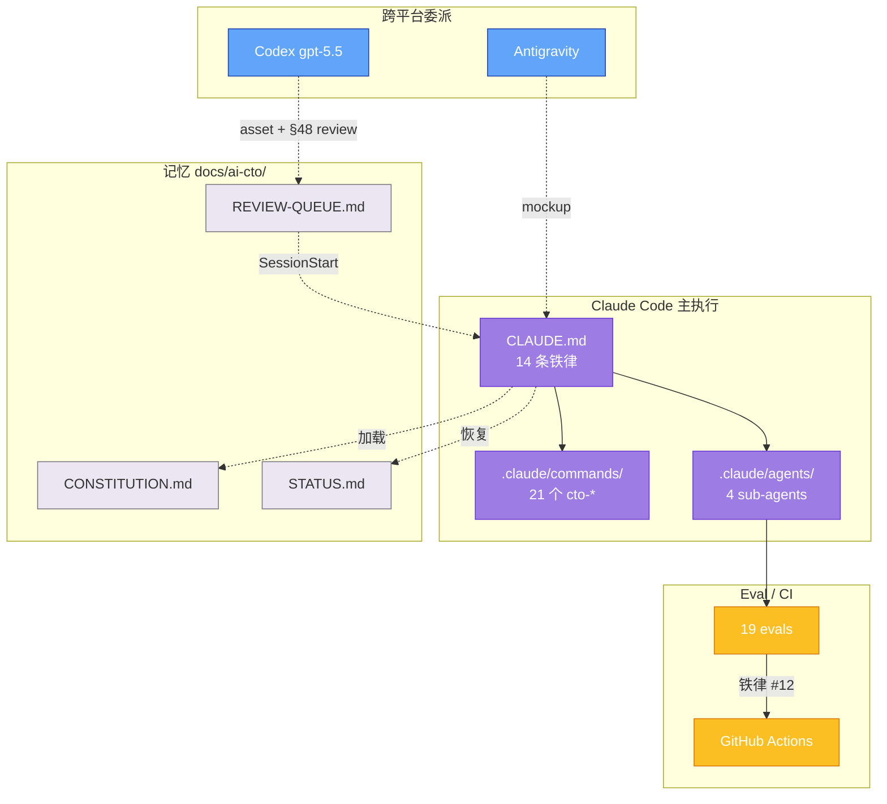

<!--
  ╔═══════════════════════════════════════════════════════════╗
  ║                      🤖 AI PLAYBOOK                       ║
  ║         Claude Code 优先的 AI CTO 闭环指挥系统            ║
  ║   Plan → Code → Review → Ship · with cross-model audit    ║
  ╚═══════════════════════════════════════════════════════════╝
-->

# AI Playbook

> **Claude Code 优先的 AI CTO 闭环指挥系统** · Plan-to-Ship · with cross-model audit

[](playbook/handbook.md)
[](.claude/commands/)
[](.claude/agents/)
[](evals/golden-trajectories/)
[](.claude/settings.json)
[](LICENSE)
[](playbook/handbook.md)
[](https://github.com/cantascendia/ai-playbook)

> 🇨🇳 用 Claude Code 做主执行器，按需委派 Antigravity / Codex，自动化 14 条铁律 · Hooks 拦截违规 · 跨模型 review · 12 + 7 条 golden trajectory eval 闭环
> 🇬🇧 Claude Code as primary executor, delegate to Antigravity / Codex on demand. Auto-enforce 14 iron rules via hooks · cross-model review · 19 golden trajectory evals.

---

## 👥 我是…

| 🆕 我是新手想试用 | 👨‍💻 我是开发者想集成 | 🏗️ 我是架构师看深度 |
|---|---|---|
| → [30 秒 Quick Start](#-30-秒上手) | → [21 个斜杠命令](#-斜杠命令清单) | → [完整手册 §1-§48](playbook/handbook.md) |
| → [架构一图流](#-架构一图流) | → [一键集成到你的项目](#-一键集成到你的项目) | → [v3.5 创新章节 §43-§48](#-v35-亮点) |

---

## ✨ 为什么选 AI Playbook

| 特性 | 原生 Claude Code | 手写 Cursor Rules | **AI Playbook** |
|---|:---:|:---:|:---:|
| 跨机器路径自适应 | ❌ | ❌ | ✅ |
| 21 个预设 slash commands | ❌ | ❌ | ✅ |
| 4 个程序化质检 sub-agents | ❌ | ❌ | ✅ |
| 19 条 golden trajectory eval | ❌ | ❌ | ✅ |
| Hooks 自动化（6 类事件）| ❌ | ⚠️ 部分 | ✅ |
| Constitution 协议（双签）| ❌ | ❌ | ✅ |
| 跨平台 Skills 双位置 | ❌ | ❌ | ✅ |
| 🆕 **Agent Reliability**（§43）| ❌ | ❌ | ✅ |
| 🆕 **Deterministic Replay**（§44）| ❌ | ❌ | ✅ |
| 🆕 **Canary Deployment**（§45）| ❌ | ❌ | ✅ |
| 🆕 **Cross-Model Auto-Review**（§48）| ❌ | ❌ | ✅ |
| 3300+ 行手册 §1-§48 | ❌ | ❌ | ✅ |

---

## 🚀 30 秒上手

```bash
# 1. clone ai-playbook 到推荐位置（跨机器一致）
git clone https://github.com/cantascendia/ai-playbook ~/.claude/playbook

# 2. 进入你的项目，启动 Claude Code
cd /your/project

# 3. 一键初始化完整 CTO 系统（21 commands + 4 agents + 5 skills + hooks）
/cto-init /your/project

# 4. 第零轮：扫描代码 → 产品愿景 → 生成 docs/ai-cto/ 记忆
/cto-start

# 5. 看完整命令清单
/help
```

---

## ✅ 5 分钟 Smoke Test（验证你装对了）

跑完一遍，确认所有组件就位：

```bash
# 1️⃣ 健康检查（无副作用）
ls .claude/commands/ | wc -l        # 应见 21
ls .claude/agents/ | wc -l          # 应见 4
ls .claude/skills/ | wc -l          # 应见 5
ls .claude/rules/ | wc -l           # 应见 3
ls evals/golden-trajectories/ | wc -l  # 应见 19+

# 2️⃣ Codex 跨模型 review 链路（如已 codex login）
codex --version                      # ≥ 0.125.0
codex login status                   # 应显示 "Logged in"

# 3️⃣ 端到端 §48 验证（30 秒）
mkdir -p src/sandbox && echo "// test" > src/sandbox/x.ts
git add src/sandbox && git commit -m "smoke: §48 trigger"
sleep 60                              # codex 后台 review ~30-60s
cat docs/ai-cto/REVIEW-QUEUE.md | tail -20  # 应见新条目

# 4️⃣ 清理（如果只是测试）
git reset --hard HEAD~1 && rm -rf src/sandbox
```

**预期产出**：
- 步骤 1 各计数符合（21/4/5/3/19+）
- 步骤 3 后 `REVIEW-QUEUE.md` 末尾出现 Codex 八维评审

如果 codex 未装，跳过 2-3 步；§48 自动 fallback 到 Claude（手册 §48.5）。

---

## 📊 架构一图流



> 完整架构图见 [`docs/assets/architecture.mmd`](docs/assets/architecture.mmd)

---

## 🎬 演示

> 📹 **Asciinema 演示**（占位）：未来录制 `/cto-init` + `/cto-start` 实时运行
>
> 📸 **GIF 演示**（占位）：`/cto-spec specify → plan → tasks` 三段式 Spec-Driven 流程

---

## 🎯 核心能力

- ⚡ **Claude Code 优先** — 主线直接读写本地代码、跑测试、git 操作 · 80% 任务无需委派
- 🤖 **21 个预设斜杠命令** — 覆盖初始化 / Spec-Driven / 审计 / 发布 / 跨模型 review 全生命周期
- 🛡️ **6 类 Hooks 自动化** — SessionStart / UserPromptSubmit / PreToolUse / PostToolUse / SubagentStop / Stop · 14 条铁律自己执行
- 🧪 **Eval-Driven Development**（§35）— 19 条 golden trajectory + 铁律 #12「无 eval 不进 main」+ GitHub Actions 自动化
- 🤝 **跨模型 Auto-Review**（§48 NEW）— Claude 完成任务 → Stop hook 自动触发 Codex (gpt-5.5) 八维评审 → 写入 REVIEW-QUEUE.md
- 🎨 **图像生成委派**（§26.5）— `/cto-image` 自动分流到 Codex (gpt-image-2 / 4K) 或 Antigravity (Nano Banana Pro / 实时数据)

---

## 🆕 v3.5 亮点

| 章节 | 创新 | 落地组件 |
|---|---|---|
| §43 | **Agent Reliability Engineering** — SRE 移植到 agent | `reliability-auditor` sub-agent + SLO.md 模板 |
| §44 | **Deterministic Replay** — Trajectory 日志 + 重放 | `/cto-replay` 命令 + PostToolUse hook |
| §45 | **Agent Canary Deployment** — feature flag + 自动 rollback | `/cto-canary` + `.github/workflows/canary.yml` |
| §46 | **MCP Skill Manifest** — 跨工具互操作元数据 | `.agents/skills-manifest.json` |
| §47 | **Agent-Native CI/CD** — Eval gate + LLM-as-Judge | `.github/workflows/eval.yml` + `llm-judge.yml` |
| §48 | **Cross-Model Auto-Review** — Claude→Codex 异步审计 | `codex-bridge` skill + `/cto-cross-review` |

---

## 📚 斜杠命令清单（21 个）

<details>
<summary>点开看全部命令</summary>

**🔧 初始化与会话**
- `/cto-init [项目路径]` — 一键初始化目标项目完整 CTO 系统
- `/cto-link [可选路径]` — 关联本机 ai-playbook（跨机器路径自适应）
- `/cto-relink-all` — 批量迁移多项目到 fallback 模板
- `/cto-start` — 新项目第零轮启动
- `/cto-resume` — 恢复会话（自动读 docs/ai-cto/）
- `/cto-refresh` — 刷新手册恢复行为规范

**📝 Spec-Driven 与宪法**
- `/cto-spec [specify|plan|tasks]` — 三段式开发（与 GitHub Spec Kit 兼容）
- `/cto-constitution [init|review|audit]` — 项目宪法管理（双签）

**✅ 审核与质量**
- `/cto-review [文件/分支]` — 交叉审核具体改动
- `/cto-vibe-check` — Vibe Coding 红线扫描
- `/cto-harness-audit` — Harness 设计自审（§34 八条原则）
- `/cto-eval [init|audit|add|run]` — Eval 集操作
- `/cto-audit` — Playbook 自身一致性质检
- `/cto-release [版本]` — 发布前最终门禁
- `/cto-replay [session-id]` 🆕 — 重放 trajectory 日志
- `/cto-canary [percent]` 🆕 — 生成 canary 部署计划
- `/cto-cross-review` 🆕 — 跨模型 review 触发器（→ Codex gpt-5.5）

**🎨 设计与图像**
- `/cto-design` — UI 设计流程（Stitch 集成）
- `/cto-image [用途]` — 图像生成委派分流（gpt-image-2 / Nano Banana Pro）

**🛠️ 生态与维护**
- `/cto-skills [list|create|audit]` — Skill 生态管理
- `/cto-models` — 模型列表更新

</details>

---

## 🔌 一键集成到你的项目

```bash
# 在 ai-playbook 仓库中
/cto-init /path/to/your-project

# 自动完成：
# - 复制 CLAUDE.md（含正确路径）
# - 复制 21 个 slash commands
# - 复制 4 个 sub-agents
# - 复制 5 个跨平台 skills
# - 复制 hooks 配置
# - 检测项目技术栈
# - 生成 docs/ai-cto/ 骨架
```

跨机器使用：换电脑后运行 `/cto-link` 自动重新发现路径。详见 [§29.8 多机器配置](playbook/handbook.md#298-多机器配置路径自适应)。

---

## 📖 完整文档

| 文件 | 用途 | 行数 |
|---|---|---|
| [CTO-PLAYBOOK.md](CTO-PLAYBOOK.md) | 操作手册入口 + 目录 + 命令速查 | 130+ |
| [playbook/handbook.md](playbook/handbook.md) | **完整手册 §1-§48** | 4000+ |
| [CLAUDE.md](CLAUDE.md) | CTO 系统提示词 + 14 条铁律 | 150+ |
| [templates/CLAUDE.md](templates/CLAUDE.md) | 目标项目精简模板 | 70+ |

**章节速查**：
- §1-§17 核心流程（环境 / 愿景 / 工具栈 / 决策框架 / 记忆持久化）
- §18-§28 高级流程（Spec-Driven / TDD / Skills / CI/CD / 设计 / 隐私）
- §29-§42 项目集成、安全、AI 工程范式
- §43-§48 🆕 ARE / Replay / Canary / Manifest / CI Judge / Cross-Review

---

## 🌟 Star History

[](https://star-history.com/#cantascendia/ai-playbook&Date)

---

## 🤝 社区 & 贡献

- 🐛 [Issues](https://github.com/cantascendia/ai-playbook/issues) — 反馈 bug / 建议
- 💬 [Discussions](https://github.com/cantascendia/ai-playbook/discussions) — 设计讨论 / Q&A
- ⭐ [Star](https://github.com/cantascendia/ai-playbook) — 喜欢就点个 star

---

## 📝 License

MIT License — 自由使用、修改、分发

---

<div align="center">

**v3.5** · §1-§48 完整手册 · 21 commands · 4 sub-agents · 19 evals · 6 hooks 自动化

Made with Claude Code · Dogfooded on itself

</div>
